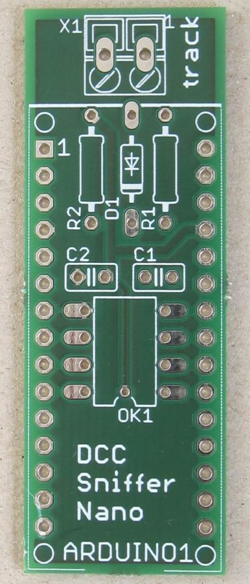
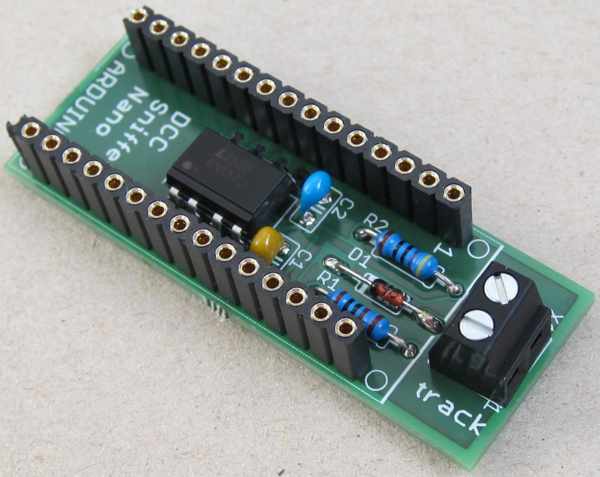
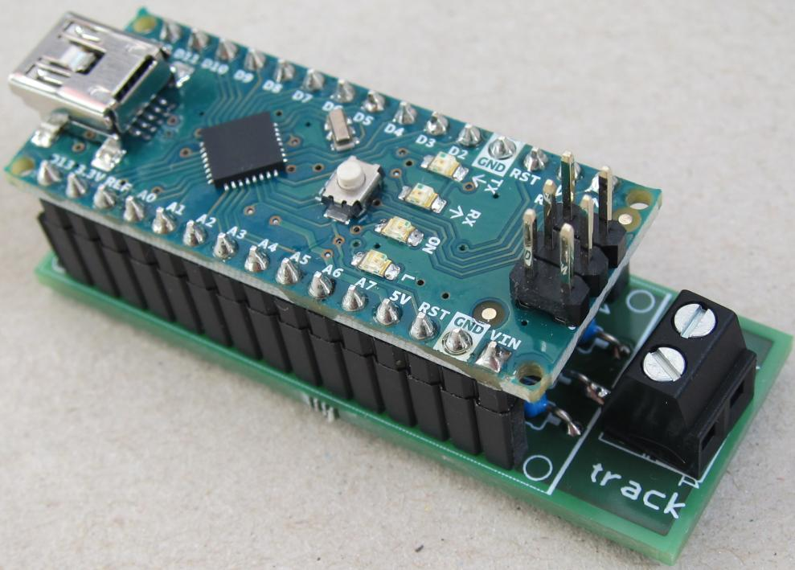

# dccSniffer
Arduino based DCC Sniffer

## Gallery

  
  
  

## References
* [Arduino Nano: Pinout](https://iotspace.dev/arduino-nano-pinout/)
* [Github: DCCInspector-EX](https://github.com/DCC-EX/DCCInspector-EX)
